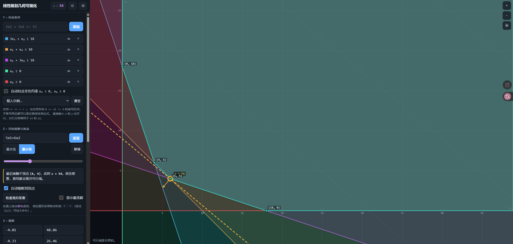
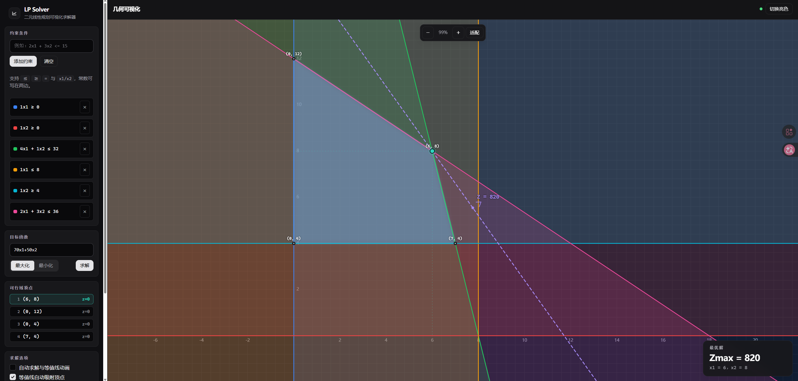

# 运筹学第二次作业

## 第一题

(1) 设甲配置$x_1$袋,乙配置$x_2$袋

$$
\max \ z = 30x_1+24x_2\\
\text{s.t.}
\begin{cases}
2x_1 + x_2 \leq 20 \\
x_1 + 2x_2 \leq 16 \\
x_1, x_2 \geq 0
\end{cases}
$$

由图解可以看出在点(8,4)处取得最优解,即 $max \ z = 30 \times 8+24 \times 4 = 336$

所以当甲配置8袋,乙配置4袋时,利润最大336元

(2) 设甲配有$100x_1$克,乙配有$100x_2$克,

$$
\min \ z= 5x_1+6x_2 \\
\text{s.t.}
\begin{cases}
3x_1+x_2 \geq 18 \\
x_1+x_2 \geq 10 \\
x_1+3x_2 \geq 18 \\
x_1,x_2 \geq 0
\end{cases}
$$

由图解可以看出在点(6,4)处取得最小值54,即$\min z=5 \times 6+6 \times 4 = 54$,所以当甲配600克,乙配400克时,一份加餐的成本最低为54元

- 本题的可行域是无界的，但可行域无界不一定目标函数就一定无界,本体目标函数$z=5x_1+6x_2$的梯度方向为(5,6),当等值线沿着(5,6)方向平移时,可行域在该方向上可以无限延伸，等值线永远不会脱离可行域，因此无最大值。当等值线沿着(-5,-6)方向平移时z值减小，当z=54时等值线与可行域仅剩一个交点，无法继续平移，因此最小值为54

(3) 设本周生产甲$x_1$千克,生产乙$x_2$千克

$$
\max \ z=70x_1+50x_2 \\
\text{s.t.}
\begin{cases}
    2x_1+3x_2 \leq 36 \\
    4x_1+x_2 \leq 32 \\
    x_1 \leq 8 \\
    x_2 \geq 4 \\
    x_1,x_2 \geq 0
\end{cases}
$$

由图解可以得出在点 (6,8) 处取得最大值,即 $\max z=70 \times 6+50 \times 8= 820$

所以当甲生产6千克,乙生产8千克时,有最大利润820元

- 其中 $x_1 \leq 8$ 完全没有起到任何限制作用,因为无论有没有这个约束条件得出的解都不变。另一个方面,约束 $4x_1+x_2 \leq 32$ 和 $x_2 \geq 0$ 的交集就已经满足 $x_1 \leq 8$ 的条件了

## 第二题

作为大学生,我们总是会在期末周面临如何在有限的时间里复习效率最大化的问题,假设最后一天要考四门课(模电，复变函数与积分变换，运筹学，大学物理),还剩四天的时间,由于吃饭,睡觉等每天固定行为,每天的有效学习时间只有11个小时,四天总共是44小时,每门课的复习时间是自行决定的量，假设单位时间每门课程分别提的分数是固定的，最后提的分数越高越好，但是每门课程有最低复习时长，低于该时长就会挂科，也有饱和时长，高于该时长分数几乎就不会提升了。以下是每门课程的提分速度，最大和最小复习时长：

|        课程        | 最小复习时间 | 饱和时间 | 单位时间提分 |
| :----------------: | :----------: | :------: | :----------: |
|        模电        |      8      |    16    |      5      |
| 复变函数与积分变换 |      6      |    14    |      4      |
|       运筹学       |      6      |    12    |      6      |
|      大学物理      |      8      |    16    |      2      |

设模电总复习时长 $x_1$ 小时，复变函数与积分变换 $x_2$小时，运筹学 $x_3$小时，大学物理 $x_4$小时

$$
\max Z = 5x_1 + 4x_2 + 6x_3 + 2x_4
$$

$$
\text{s.t.}
\begin{cases}
x_1 + x_2 + x_3 + x_4 \leq 44 \\
8 \leq x_1 \leq 16 \\
6 \leq x_2 \leq 14 \\
6 \leq x_3 \leq 12 \\
8 \leq x_4 \leq 16 \\
x_1,x_2,x_3,x_4 \geq 0
\end{cases}
$$

使用 Google OR-Tools 线性规划求解器对上述模型求解,得到最优解如下:

|          课程          | 复习时间(小时) |
| :---------------------: | :------------: |
|        模电$x_1$        |       16       |
| 复变函数与积分变换$x_2$ |       8       |
|       运筹学$x_3$       |       12       |
|      大学物理$x_4$      |       8       |

最优值 $\max Z = 5\times16 + 4\times8 + 6\times12 + 2\times8 = 200$。

从结果可以看出,提分效率最高的运筹学和模电被优先复习到饱和时长,提分效率较低的复变函数与积分变换,大学物理仅达到挂科线附近,这说明在时间有限的约束下,应优先把时间投入到单位时间提分最高的科目上

## 第三题

$$
令
\begin{cases}
x_1 + 2x_2 + 2x_3 = 40 \quad --- \quad  (1) \\
3x_1 + 2x_2 + x_3 = 60 \quad --- \quad  (2) \\
x_1 = 0 \quad --- \quad  (3) \\
x_2 = 0 \quad --- \quad  (4) \\
x_3 = 0 \quad --- \quad  (5) \\
\end{cases}
$$

从这五个边界面中任取三个方程求解可以得到 $C_5^3=10$ 个顶点:

| 序号 | 选取方程 | $x_1$ | $x_2$ | $x_3$ |    可行性    | 目标函数值 |
| :--: | :------: | :---: | :---: | :---: | :-----------: | :--------: |
|  1  |  (123)  |   0   |  40  |  -20  | 不满足$x_3<0$ |     —     |
|  2  |  (124)  |  16  |   0   |  12  |    可行解    |    1560    |
|  3  |  (125)  |  10  |  15  |   0   |    可行解    |    1800    |
|  4  |  (134)  |   0   |   0   |  20  |    可行解    |    1000    |
|  5  |  (135)  |   0   |  20  |   0   |    可行解    |    1600    |
|  6  |  (145)  |  40  |   0   |   0   |   不满足②   |     —     |
|  7  |  (234)  |   0   |   0   |  60  |   不满足①   |     —     |
|  8  |  (235)  |   0   |  30  |   0   |   不满足①   |     —     |
|  9  |  (245)  |  20  |   0   |   0   |    可行解    |    1200    |
|  10  |  (345)  |   0   |   0   |   0   |    可行解    |     0     |

在所有满足条件的顶点中,点 3 $(10,15,0)$ 目标函数值最大,$z=1800$,故最优解为 $x_1=10,\ x_2=15,\ x_3=0$,最优值 $\max z=1800$

- 观察最优解可以发现 $x_3=0$,我认为这正是该规划问题下利益最大化的体现,因为丙产品利润是最低的,而甲乙的产量也与他们各自的利润成正相关,因为甲利润最高,所以产量也是最高的,但是受制于牛皮数量和工时,不能做到全部生产甲,于是最优解是(10,15,0),所以看似巧合,其实是线性规划模型权衡各种条件下的必然结果
